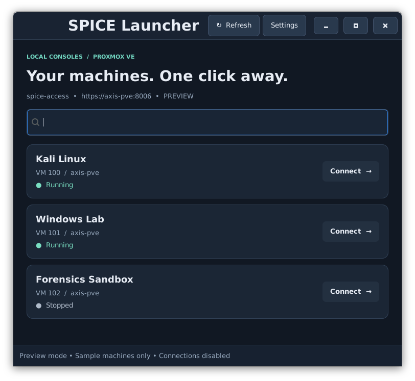

# SPICE Pool Launcher

SPICE Pool Launcher is a small GTK desktop application for opening Proxmox VE virtual-machine consoles without downloading short-lived `.vv` files through a browser.

The launcher reads the QEMU virtual machines in a nominated Proxmox resource pool, displays their names and current state, requests a fresh SPICE ticket when a connection is opened, and starts `remote-viewer`. Pool membership is the enrolment mechanism: add or remove a VM in Proxmox, then refresh the launcher.



## Features

- Lists QEMU virtual machines from a configured Proxmox resource pool.
- Shows each VM's name, ID, node and running state.
- Searches by VM name or ID.
- Opens a console by button or double-click.
- Supports QXL/SPICE, VirtIO-GPU and VirGL GPU displays.
- Allows multiple VM consoles to remain open at once.
- Uses a restricted Proxmox API token instead of a stored account password.
- Verifies the Proxmox HTTPS certificate and refuses redirects.
- Creates short-lived viewer files only in the user's private runtime directory; nothing is written to Downloads.
- Includes a demonstration mode that requires no Proxmox credentials.

## Requirements

- Linux desktop with Python 3.
- GTK 3 and PyGObject (`python3-gi` and `gir1.2-gtk-3.0` on Debian-based systems).
- Remote Viewer from the `virt-viewer` package.
- Proxmox VE reachable over HTTPS and SPICE proxy port `3128`.
- A Proxmox resource pool, limited API account and privilege-separated API token.

On a Debian-based desktop, install the runtime dependencies as root if they are not already present:

```bash
apt install python3 python3-gi gir1.2-gtk-3.0 virt-viewer
```

The application has no pip dependencies.

## Proxmox setup

The example below creates a dedicated pool, group, role, account and API token. Run these commands once as `root` on a Proxmox node. Change the names if they already exist or you prefer different ones.

```bash
pveum pool add spice-access --comment 'VM consoles available to the desktop launcher'
pveum group add spice-users --comment 'SPICE launcher users'
pveum role add SpiceLauncher --privs 'Pool.Audit VM.Audit VM.Console'
pveum user add spice-launcher@pve --groups spice-users --comment 'Desktop SPICE launcher'
pveum acl modify /pool/spice-access --groups spice-users --roles SpiceLauncher --propagate 1
pveum user token add spice-launcher@pve desktop --privsep 1
pveum acl modify /pool/spice-access --tokens 'spice-launcher@pve!desktop' --roles SpiceLauncher --propagate 1
```

Proxmox displays the API token secret once. Save it somewhere private until it has been entered into the launcher. Do not place it in this repository.

The custom role contains only:

- `Pool.Audit` to read the pool and its members.
- `VM.Audit` to read the VM name, state and display configuration.
- `VM.Console` to request a console ticket.

It does not permit VM configuration, start, stop or deletion, and it cannot alter pool membership. Because the token uses privilege separation, its effective permissions are the intersection of the API account's permissions and the token's permissions; both grants above are required.

### Trust the Proxmox certificate

Copy the public Proxmox CA certificate to a private, user-readable location. Replace `USERNAME` and its group where required:

```bash
install -d -m 700 -o USERNAME -g USERNAME /home/USERNAME/.config/spice-launcher
install -m 600 -o USERNAME -g USERNAME /etc/pve/pve-root-ca.pem /home/USERNAME/.config/spice-launcher/proxmox-ca.pem
```

The server address entered later must use a hostname covered by the Proxmox certificate. Certificate verification is mandatory.

## Enrol virtual machines

VM enrolment is deliberately managed in Proxmox rather than in the launcher.

1. Open the Proxmox web interface.
2. Switch the resource tree to **Pool View**.
3. Select the `spice-access` pool.
4. Open **Members**, choose **Add → Virtual Machine**, and select the VMs to enrol.
5. For each VM, open **Hardware → Display → Edit** and select **SPICE**, **VirtIO-GPU** or **VirGL GPU**.
6. Start the VM and refresh the launcher.

Removing a VM from the pool prevents the launcher from requesting future console tickets. It does not delete the VM or forcibly close a console that is already connected.

## Run the launcher

From the repository directory:

```bash
python3 launcher.py
```

To preview the interface with sample VMs and no network connection:

```bash
python3 launcher.py --demo
```

On first launch, open **Settings** and enter:

| Field | Example |
| --- | --- |
| Proxmox HTTPS address | `https://axis-pve:8006` |
| Resource pool | `spice-access` |
| API token ID | `spice-launcher@pve!desktop` |
| Trusted CA certificate | `/home/USERNAME/.config/spice-launcher/proxmox-ca.pem` |
| API token secret | The value shown when the token was created |

Choose **Save & refresh**. Running VMs can then be opened with **Connect** or by double-clicking their card. Stopped VMs remain visible but cannot be connected until started in Proxmox.

## Desktop application entry

The supplied desktop entry expects this repository at `/opt/github_repo/spice-launcher`. Install it for the current user with:

```bash
mkdir -p ~/.local/share/applications
cp spice-launcher.desktop ~/.local/share/applications/
```

If the repository lives elsewhere, edit the `Exec=` path in `spice-launcher.desktop` before copying it.

## Configuration and security

The launcher stores local configuration under `${XDG_CONFIG_HOME:-~/.config}/spice-launcher`:

- `settings.json` contains the server, pool, token ID and CA path.
- `token` contains the API token secret and is required to be owned by the current user with no group or other permissions.

Connection files are created in a unique private directory under `$XDG_RUNTIME_DIR`. Remote Viewer receives `delete-this-file=1`, and the launcher removes the temporary directory after the viewer exits or fails. If the launcher is forcibly terminated, the user's runtime directory is normally cleared at logout.

The launcher disables environment HTTP proxies, refuses HTTPS redirects, verifies the server certificate, and checks that the SPICE proxy returned by Proxmox matches the configured server. It does not log API secrets or ticket contents. Software already running as the same desktop user can still access that user's saved token.

## Testing

Run the focused test suite with:

```bash
PYTHONDONTWRITEBYTECODE=1 python3 -m unittest -v
```

The tests cover settings validation, private file permissions, redirect and proxy rejection, pool membership checks, stopped VMs, temporary-file cleanup, and supported display types.

## Troubleshooting

- **401 / token rejected:** Check the token ID and secret, and confirm that the API account and token are enabled.
- **403 / permission denied:** Confirm that both the account's group and the privilege-separated token have the `SpiceLauncher` role on the configured pool.
- **Certificate verification failed:** Use the hostname present on the Proxmox certificate and the correct CA file. Do not disable certificate verification.
- **No VMs shown:** Confirm the pool name, manually enrol QEMU VMs in that pool, then refresh.
- **Connect is disabled:** Start the VM in Proxmox.
- **Unsupported display:** Configure QXL/SPICE, VirtIO-GPU or VirGL GPU for that VM.
- **Viewer cannot connect:** Confirm port `3128` is reachable and retry so the launcher requests a fresh short-lived ticket.

## Limitations

- Pool membership must be managed manually in Proxmox.
- The launcher lists QEMU virtual machines only; LXC containers and storage entries are ignored.
- It opens consoles but does not start, stop or configure VMs.
- The desktop entry contains a fixed installation path unless edited.
- Removing pool access does not guarantee that an existing console session is disconnected immediately.

## Licence

This project is licensed under the GNU General Public License v3.0. See [LICENSE](LICENSE).
